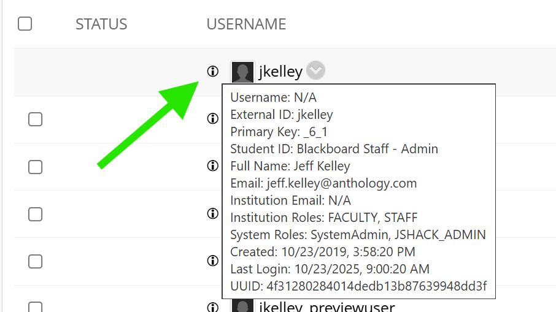

# Blackboard User Details bookmarklet

This bookmarklet adds a tooltip icon for each user on the admin manage user page. 
Hovering over the tooltip fetches some addtional information using the REST API

---

## Features

- Shows a tooltip near the avatar icon
- Hovering over the icon displays addtional information about the user
- Works inside the Ultra frameset and verifies correct manage user page 
- Read-only: Does not modify Blackboard data.

---

## Safety Notes

- **Read-only:** The bookmarklet only reads IDs and adds temporary outlines and tooltips.

---

[Back to Project Overview](../README.md)
